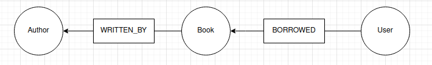
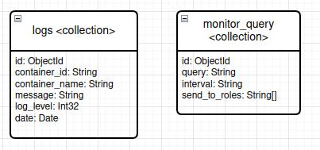
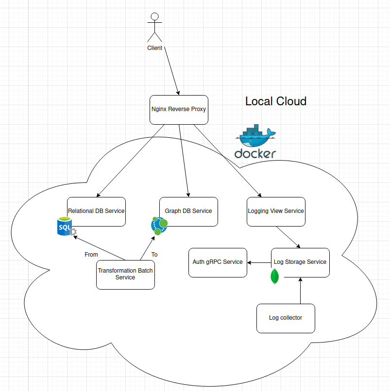
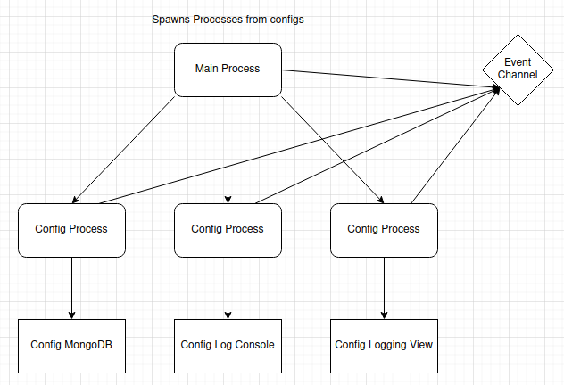
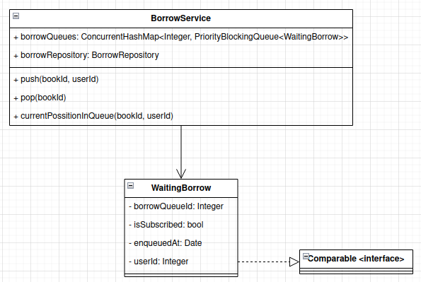

# Database Exam Project

## Table of Contents

- [Introduction](#introduction)
- [Usage](#usage)
  - [Container Interaction](#container-interaction)
  - [Application Interaction](#application-interaction)
  - [Auth](#auth)
  - [Postman](#postman)
- [Problem Definition](#problem-definition)
  - [Non-Functional](#non-functional)
  - [Functional](#functional)
- [Database Models](#database-models)
  - [Relational Database](#relational-database)
  - [Graph Database](#graph-database)
  - [Document Database](#document-database)
  - [Key-Value Database](#key-value-database)
- [Data Transformation](#data-transformation)
- [Diagrams](#diagrams)

## Introduction

This project is a system for online book borrowing. It was developed for the Database subject at Cphbusiness in Denmark.
The application allows users to borrow books, be put in a borrow queue, get book recommendations, check system logs, and more.

## Usage

To run the environment, all you need to do is run the start script in the root directory.

```bash
# -e to expose the databases for you to see whats in them
sh start.sh -e
```

This will run an alpine container which is also running docker. This container will be the one serving all our applications.

### Container Interaction

If you want to run command to see what's happening with the services running, this has to be done through the root app. You have two options:

- Run commands from your root terminal

```bash
docker exec youbook docker ps
```

- Exec into youbook and perform your actions from in there

```bash
docker exec -it youbook sh
```

### Application Interaction

Everything is exposed through a nginx proxy.

Applications are available through: `localhost/<service>/<uri-inside-service>`
Databases are available through: `localhost:{27017,7474,1433}` for either MongoDB, Neo4j or MSSQL

List of available services:

- logging-view (view for querying logs)

  - Username: cph-tz11@cphbusiness.dk
  - Password: thisIsSuperStrong1234

- log-api (API the logging view queries)
- sql-service
- neo4j-service

#### Auth

To perform actions in our system basic authentication is required with all actions that require authentication.

Available users:

- Employee:

  - Username: cph-tz11@cphbusiness.dk
  - Password: thisIsSuperStrong1234

- subscribed:

  - Username: cph-mw202@cphbusiness.dk
  - Password: thisIsSuperStrong1234

- free:

  - Username: cph-mj839@cphbusiness.dk
  - Password: thisIsSuperStrong1234

### Postman

To ease the process of executing a process, a postman collection has been made, and can be found [here](./documents/postman/youbook.postman_collection.json)

## Problem Definition

E-Corp Inc. wants to have an online book borrow service called YouBook, which can handle a high amount of requests.
The company therefore wants to have multiple databases implemented of different storage types.
The employees moderate the library and its contents using YouBook’s API.
Users are given recommendations based on data gathered throughout the application.
Users provide ratings of books using the YouBook app.
The service is meant to be free-to-use, but offers a paid subscription service for users who wish to have certain benefits.

## Requirements

### Non-Functional

- The system must make use of multiple different databases.
- The system must have low response time.
- The system must have backups stored, so that the system can be replicated in the event of system failure.
- The system must be performance validated, to ensure the quality of the application.
- In order to comply with licensing rules, the system must not provide the ability to download books.
- The system must provide notifications in case of errors in the system.
- The system must provide the ability to monitor the current state of YouBook.

### Functional

User requirements:

- Users must be able to get recommendations for specific books and authors based on the individual user data.
- Users must be able to search for/filter books using various parameters.
- Users must be able to rate books.

Subscribed user requirements:

- Subscribed users must be able to loan an unlimited amount of books.
- Subscribed users must have a higher priority in the renting queue.

Free user requirements:

- Free users must have a maximum of 5 loans at the same time.

Employee requirements:

- Employees' must have the ability to manage books in the library.

## Database models

### Relational Database

The relational database MSSQL was chosen, as it includes a lot of features that make creating stored procedures and other features that can make the performance of our queries faster.

### Graph Database

The graph database Neo4j was selected as it allows us to run a multitude of different operations that would help us with recommendations on books and authors.
Cypher is also an interesting language to work with as its syntax supports the “graph-mindset” with the way you write relations between nodes etc.

The recommendations will be based of:

- **Other popular books written by the same author** of the book a user has previously borrowed.
- **Other popular books that users have also borrowed**, after having borrowed the same book a user has borrowed.
- **New books written by the same author** of the books a user has previously borrowed.

#### Graph diagram



### Document Database

The document database MongoDB was selected to hold all application logs, as it includes great features creating dynamic queries for searching and filtering.
It also includes ways for decreasing response times for an ever-growing logging system.

#### Collections



### Key-Value Database

The key-value database Redis has been chosen as fast in memory caching. It will be used to keep values that are not required to be in the correct state in memory.
This will be done through the TTL (time-to-live) feature of Redis.

## Data transformation

- Data will be transitioned from multiple log files, and transformed into a MongoDB model used for log querying and storage.
- Data will be transitioned from the MSSQL database into Neo4j taking only the data required to run the algorithms used to generate the recommendations mentioned under the Graph Database section.

## Diagrams

### Architecture



### Application launcher



### Book priority queue


